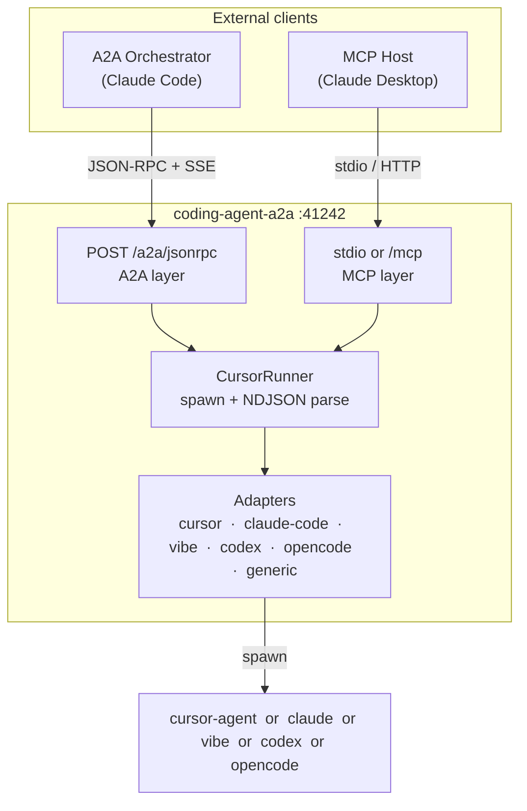

# coding-agent-a2a

A2A + MCP server that wraps any supported coding-agent CLI (Cursor, Claude Code) and exposes it to orchestrators over **two protocols simultaneously** on the same port:

| Protocol | Transport | Who uses it |
|----------|-----------|-------------|
| **A2A** v0.3.0 | HTTP JSON-RPC 2.0 + SSE | Claude Code, any A2A-compatible orchestrator |
| **MCP** | stdio or HTTP (`/mcp`) | Claude Desktop, any MCP host |

Both protocols share the same underlying adapter, runner, and process-lifecycle logic.

---

## Quick start

### Prerequisites

- Node.js 20 or later
- One supported CLI on your `PATH` (or set the path explicitly via env var):
  - `cursor-agent` — [Cursor](https://cursor.sh) agent CLI
  - `claude` — [Claude Code](https://claude.ai/code) CLI
  - `vibe` — [Mistral Vibe](https://docs.mistral.ai/mistral-vibe/terminal) CLI
  - `codex` — [Codex](https://codex.sh) CLI
  - `opencode` — [OpenCode](https://github.com/saoudrizwan/OpenCode) CLI
  - Any custom CLI via the `generic` adapter

### Install and run

```bash
git clone https://github.com/casabre/coding-agent-a2a
cd coding-agent-a2a
npm install
npm run build
```

Copy and edit the example env file:

```bash
cp .env.example .env
# Set at minimum: AGENT_ADAPTER and AGENT_REPO_PATH
```

Start the server:

```bash
npm start
# coding-agent-a2a v0.1.0
# adapter:       cursor
# A2A endpoint:  http://localhost:41242/a2a/jsonrpc
# Agent Card:    http://localhost:41242/.well-known/agent-card.json
# MCP transport: stdio
```

### Use with Claude Desktop

See **[docs/deployment.md](docs/deployment.md#claude-desktop)** for step-by-step Claude Desktop configuration, or jump directly to **[docs/claude-desktop-config.md](docs/claude-desktop-config.md)**.

---

## Architecture overview



For a detailed component breakdown, design decisions, and event-flow diagrams, see **[docs/architecture.md](docs/architecture.md)**.

---

## Environment variables

| Variable | Default | Description |
|----------|---------|-------------|
| `PORT` | `41242` | HTTP port (A2A and, when `MCP_TRANSPORT=http`, MCP) |
| `AGENT_ADAPTER` | `cursor` | `cursor` or `claude-code` or `vibe` or `codex` or `opencode` or `generic` |
| `AGENT_MODEL` | — | Model override forwarded to the CLI |
| `AGENT_TIMEOUT_MS` | `120000` | Hard timeout per task (ms); `0` = disabled |
| `AGENT_IDLE_EXIT_MS` | `0` | Kill if no stdout for this long (ms); `0` = disabled |
| `AGENT_FORCE` | `true` | Skip shell-approval prompts (`-f` / `--dangerously-skip-permissions`) |
| `AGENT_REPO_PATH` | `.` | Working directory passed to the CLI as `cwd` |
| `MCP_TRANSPORT` | `stdio` | `stdio` (Claude Desktop spawns the process) or `http` |
| `LOG_LEVEL` | `info` | `debug` \| `info` \| `warn` \| `error` |
| `VIBE_BINARY_PATH` | `vibe` | Path to Vibe CLI binary |
| `CODEX_BINARY_PATH` | `codex` | Path to Codex CLI binary |
| `OPENCODE_BINARY_PATH` | `opencode` | Path to OpenCode CLI binary |
| `AGENT_BINARY` | — | Path to custom binary (required for `generic` adapter) |
| `AGENT_ARGS` | `""` | Default arguments for custom binary |
| `AGENT_APPROVAL_PATTERN` | — | Regex pattern to detect approval prompts (for `generic` adapter) |
| `AGENT_APPROVAL_RESPONSE` | `y` | Response string for approval prompts (for `generic` adapter) |

Full configuration reference with validation rules: **[docs/deployment.md#configuration](docs/deployment.md#configuration)**.

### Using Different Adapters

#### Vibe CLI
```bash
export AGENT_ADAPTER=vibe
export VIBE_BINARY_PATH=/path/to/vibe  # Optional, defaults to "vibe"
export AGENT_REPO_PATH=/path/to/repo
npm start
```

#### Codex CLI
```bash
export AGENT_ADAPTER=codex
export CODEX_BINARY_PATH=/path/to/codex  # Optional, defaults to "codex"
export AGENT_REPO_PATH=/path/to/repo
npm start
```

#### OpenCode CLI
```bash
export AGENT_ADAPTER=opencode
export OPENCODE_BINARY_PATH=/path/to/opencode  # Optional, defaults to "opencode"
export AGENT_REPO_PATH=/path/to/repo
npm start
```

#### Custom CLI (Generic Adapter)
```bash
export AGENT_ADAPTER=generic
export AGENT_BINARY=/path/to/your-agent  # Required
export AGENT_ARGS="--stream --model my-model"  # Optional: default args
export AGENT_APPROVAL_PATTERN="\[Y\/n\]"  # Optional: custom approval pattern
export AGENT_APPROVAL_RESPONSE="yes"  # Optional: custom approval response
npm start
```

> **Note:** The `generic` adapter assumes your CLI produces NDJSON-compatible streaming output. All built-in adapters (`cursor`, `claude-code`, `vibe`, `codex`, `opencode`) use the same NDJSON event parser.

---

## MCP tools

| Tool | Description |
|------|-------------|
| `coding_agent_run` | Submit a coding task; returns `job_id` immediately |
| `coding_agent_poll` | Poll new events since a given line offset |
| `coding_agent_result` | Retrieve the final result and clean up the job |
| `coding_agent_cancel` | Cancel a running job |
| `coding_agent_info` | Return adapter name, capabilities, and server version |

Full parameter schemas and examples: **[docs/api/mcp-tools.md](docs/api/mcp-tools.md)**.

---

## A2A protocol

The A2A surface exposes one skill (`code-task`) and supports streaming via `message/stream`.
The agent card is served at `GET /.well-known/agent-card.json`.

Full method reference, event shapes, and state machine: **[docs/api/a2a.md](docs/api/a2a.md)**.

---

## Development

See **[docs/development.md](docs/development.md)** for:
- Local dev setup
- Test strategy (unit / integration / e2e)
- How to add a new adapter

See **[CONTRIBUTING.md](CONTRIBUTING.md)** for the PR process and code standards.

---

## Credits

Event-mapping patterns and protocol wiring inspired by:

- **cursor-agent-mcp** by sailay1996 — MIT License ([LICENSES/cursor-agent-mcp.LICENSE](LICENSES/cursor-agent-mcp.LICENSE))
- **A2A-MCP-Server** by GongRzhe — Apache 2.0 License ([LICENSES/a2a-mcp-server.LICENSE](LICENSES/a2a-mcp-server.LICENSE))
