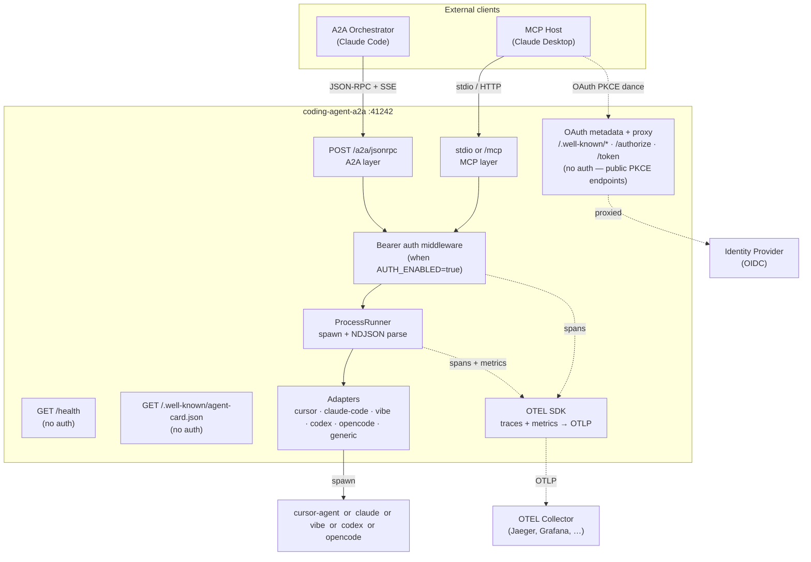

# coding-agent-a2a

A2A + MCP server that wraps any supported coding-agent CLI (Cursor, Claude Code, Vibe, Codex, OpenCode) and exposes it to orchestrators over **two protocols simultaneously** on the same port:

| Protocol | Transport | Who uses it |
|----------|-----------|-------------|
| **A2A** v1.0 | HTTP JSON-RPC 2.0 + SSE | Claude Code, any A2A-compatible orchestrator |
| **MCP** | stdio or HTTP (`/mcp`) | Claude Desktop, any MCP host |

Both protocols share the same underlying adapter, runner, and process-lifecycle logic.

---

## Quick start

### Run from source (local dev)

**Prerequisites:** Node.js 20+, one supported CLI on `PATH`.

```bash
git clone https://github.com/casabre/coding-agent-a2a
cd coding-agent-a2a
npm install
npm run build
cp .env.example .env   # set AGENT_ADAPTER and AGENT_REPO_PATH at minimum
npm start
```

### Run with Docker

Pull the base image and point it at your CLI binary:

```bash
docker run --rm \
  -e AGENT_ADAPTER=claude-code \
  -e CLAUDE_CODE_PATH=/usr/local/bin/claude \
  -e AGENT_REPO_PATH=/workspace \
  -v /path/to/my/project:/workspace \
  -v /usr/local/bin/claude:/usr/local/bin/claude:ro \
  -p 41242:41242 \
  ghcr.io/casabre/coding-agent-a2a:latest
```

> The base image contains only the server — no CLI binary. Mount or copy one in; see the [Docker](#docker) section for patterns.

### Use with Claude Desktop

See **[docs/deployment.md](docs/deployment.md#claude-desktop)** for step-by-step Claude Desktop configuration, or jump to **[docs/claude-desktop-config.md](docs/claude-desktop-config.md)**.

---

## Architecture overview



For a detailed component breakdown, design decisions, and event-flow diagrams, see **[docs/architecture.md](docs/architecture.md)**.

---

## Docker

### Base image

The published image contains **only the Node.js server** — no CLI binary. This keeps it small and gives you full control over which agent binary runs inside the container.

```
ghcr.io/casabre/coding-agent-a2a:latest        # latest main
ghcr.io/casabre/coding-agent-a2a:v0.1.0        # pinned release
ghcr.io/casabre/coding-agent-a2a:0.1           # minor-pinned
```

The server binary path is resolved at startup from the adapter-specific env var (e.g. `CLAUDE_CODE_PATH`) and falls back to the bare name on `PATH`.

### Extending the base image

All example Dockerfiles live in [`examples/`](examples/).

#### Copy in a pre-built binary

```dockerfile
# examples/Dockerfile.claude-code
FROM ghcr.io/casabre/coding-agent-a2a:latest

USER root
COPY --from=my-claude-builder /usr/local/bin/claude /usr/local/bin/claude
RUN chmod +x /usr/local/bin/claude
USER node

ENV AGENT_ADAPTER=claude-code
```

```bash
docker build -f examples/Dockerfile.claude-code -t my-claude-agent .
docker run -e AGENT_REPO_PATH=/workspace -v /my/project:/workspace my-claude-agent
```

#### Add a language runtime (Python example)

The `generic` adapter can run any CLI that emits the expected NDJSON events. Add the runtime and your script on top of the base image:

```dockerfile
# examples/Dockerfile.python-agent
FROM ghcr.io/casabre/coding-agent-a2a:latest

USER root
RUN apt-get update \
    && apt-get install -y --no-install-recommends python3 python3-pip \
    && rm -rf /var/lib/apt/lists/*
COPY my_agent.py /usr/local/bin/my-agent.py
RUN chmod +x /usr/local/bin/my-agent.py
USER node

ENV AGENT_ADAPTER=generic \
    AGENT_BINARY=python3 \
    AGENT_ARGS=/usr/local/bin/my-agent.py
```

> Your `my_agent.py` must produce NDJSON events on stdout. See [docs/architecture.md](docs/architecture.md) for the event schema.

#### Mount the binary at runtime (no rebuild)

```bash
docker run --rm \
  -e AGENT_ADAPTER=generic \
  -e AGENT_BINARY=/bin/my-agent \
  -v /usr/local/bin/my-agent:/bin/my-agent:ro \
  -v /my/project:/workspace \
  -e AGENT_REPO_PATH=/workspace \
  -p 41242:41242 \
  ghcr.io/casabre/coding-agent-a2a:latest
```

### Health check

The image has a built-in `HEALTHCHECK` on `/health`. Docker reports the container healthy once the server has started:

```bash
docker inspect --format '{{.State.Health.Status}}' my-container
# healthy
```

---

## Kubernetes (Helm)

A Helm chart ships with the repo under [`helm/coding-agent-a2a/`](helm/coding-agent-a2a/).

### Prerequisites

- Helm 3
- Kubernetes 1.21+

### Install

```bash
helm install my-agent ./helm/coding-agent-a2a \
  --set agent.adapter=claude-code \
  --set image.tag=v0.1.0
```

Or from a `values.yaml` override file:

```bash
helm install my-agent ./helm/coding-agent-a2a -f my-values.yaml
```

### Common configuration

| Value | Default | Description |
|-------|---------|-------------|
| `image.repository` | `ghcr.io/casabre/coding-agent-a2a` | Image to deploy |
| `image.tag` | `latest` | Image tag |
| `agent.adapter` | `cursor` | Adapter: `cursor` \| `claude-code` \| `vibe` \| `codex` \| `opencode` \| `generic` |
| `agent.timeoutMs` | `120000` | Hard timeout per task (ms) |
| `workspace.type` | `emptyDir` | Workspace volume: `emptyDir` \| `pvc` \| `hostPath` |
| `auth.enabled` | `false` | Enable OAuth 2.0 Bearer auth |
| `otel.enabled` | `false` | Enable OpenTelemetry traces and metrics |
| `otel.endpoint` | — | OTLP receiver URL (e.g. `http://otel-collector:4318`) |
| `replicaCount` | `1` | Pod replicas (stateless — scales horizontally) |

See [`helm/coding-agent-a2a/values.yaml`](helm/coding-agent-a2a/values.yaml) for the full reference with inline comments.

### Workspace volume

Each task spawns a CLI process in `AGENT_REPO_PATH`. Configure the workspace volume to match your use case:

```yaml
# ephemeral (default — tasks work on files copied in by the caller)
workspace:
  type: emptyDir

# persistent volume claim (provision new PVC automatically)
workspace:
  type: pvc
  pvc:
    storageClass: standard
    size: 20Gi

# use an existing PVC
workspace:
  type: pvc
  pvc:
    claimName: my-existing-pvc

# host path (dev/testing only)
workspace:
  type: hostPath
  hostPath:
    path: /data/workspace
```

### Auth in Kubernetes

Supply auth secrets separately from the chart values so they are not stored in plain text:

```bash
kubectl create secret generic my-agent-auth \
  --from-literal=AUTH_ISSUER=https://idp.example.com \
  --from-literal=AUTH_AUDIENCE=coding-agent \
  --from-literal=AUTH_JWKS_URI=https://idp.example.com/.well-known/jwks.json

helm install my-agent ./helm/coding-agent-a2a \
  --set auth.enabled=true \
  --set auth.existingSecret=my-agent-auth \
  --set auth.oidcDiscoveryUrl=https://idp.example.com/.well-known/openid-configuration
```

### Enable OTEL in Kubernetes

```yaml
# my-values.yaml
otel:
  enabled: true
  endpoint: http://otel-collector.monitoring:4318
  serviceName: coding-agent-a2a
```

---

## Environment variables

### Core

| Variable | Default | Description |
|----------|---------|-------------|
| `PORT` | `41242` | HTTP port (A2A and, when `MCP_TRANSPORT=http`, MCP) |
| `AGENT_ADAPTER` | `cursor` | `cursor` \| `claude-code` \| `vibe` \| `codex` \| `opencode` \| `generic` |
| `AGENT_MODEL` | — | Model override forwarded to the CLI |
| `AGENT_TIMEOUT_MS` | `120000` | Hard timeout per task (ms); `0` = disabled |
| `AGENT_IDLE_EXIT_MS` | `0` | Kill if no stdout for this long (ms); `0` = disabled |
| `AGENT_FORCE` | `true` | Skip shell-approval prompts (`-f` / `--dangerously-skip-permissions`) |
| `AGENT_REPO_PATH` | `.` | Working directory passed to the CLI as `cwd` |
| `MCP_TRANSPORT` | `stdio` | `stdio` (Claude Desktop spawns the process) or `http` |
| `LOG_LEVEL` | `info` | `debug` \| `info` \| `warn` \| `error` |
| `CONFIG_FILE` | — | Path to a JSON config file; env vars always override file values |

### Adapter binary paths (optional overrides)

| Variable | Default | Adapter |
|----------|---------|---------|
| `CURSOR_AGENT_PATH` | `cursor-agent` | `cursor` |
| `CLAUDE_CODE_PATH` | `claude` | `claude-code` |
| `VIBE_BINARY_PATH` | `vibe` | `vibe` |
| `CODEX_BINARY_PATH` | `codex` | `codex` |
| `OPENCODE_BINARY_PATH` | `opencode` | `opencode` |
| `AGENT_BINARY` | — | `generic` (required) |
| `AGENT_ARGS` | `""` | `generic` — default arguments |
| `AGENT_APPROVAL_PATTERN` | — | `generic` — regex to detect approval prompts |
| `AGENT_APPROVAL_RESPONSE` | `y` | `generic` — response string for approval prompts |

### Authentication

All optional; only used when `AUTH_ENABLED=true`.

| Variable | Default | Description |
|----------|---------|-------------|
| `AUTH_ENABLED` | `false` | Enable OAuth 2.0 Bearer auth on `/a2a/jsonrpc` and `/mcp` |
| `AUTH_OIDC_DISCOVERY_URL` | — | OIDC discovery URL; auto-fills the three URLs below |
| `AUTH_AUTHORIZATION_URL` | — | IdP `/authorize` endpoint (required if no discovery URL) |
| `AUTH_TOKEN_URL` | — | IdP `/token` endpoint (required if no discovery URL) |
| `AUTH_JWKS_URI` | — | IdP JWKS endpoint for token verification (required if no discovery URL) |
| `AUTH_ISSUER` | — | Expected `iss` claim (required when `AUTH_ENABLED=true`) |
| `AUTH_AUDIENCE` | — | Expected `aud` claim (required when `AUTH_ENABLED=true`) |
| `AUTH_REQUIRED_SCOPES` | — | Comma-separated scopes required on incoming tokens (e.g. `agent:run`) |
| `AUTH_SERVER_URL` | `http://localhost:PORT` | This server as Authorization Server (OAuth metadata issuer URL) |
| `AUTH_RESOURCE_URL` | `AUTH_SERVER_URL/mcp` | This server as Resource Server (RFC 9728) |
| `AUTH_ALLOWED_REDIRECT_URIS` | — | Comma-separated allowed redirect URIs; if unset, IdP validates |

### Observability

| Variable | Default | Description |
|----------|---------|-------------|
| `OTEL_ENABLED` | `false` | Enable OpenTelemetry traces and metrics |
| `OTEL_EXPORTER_OTLP_ENDPOINT` | — | OTLP receiver URL (e.g. `http://otel-collector:4318`) |
| `OTEL_SERVICE_NAME` | `unknown_service` | Service name in traces and metrics |
| `OTEL_TRACES_SAMPLER` | `always_on` | Standard OTEL sampling strategy |
| `OTEL_METRIC_EXPORT_INTERVAL` | `60000` | Metric push interval (ms) |

Full configuration reference with validation rules: **[docs/deployment.md#configuration](docs/deployment.md#configuration)**.

---

## Authentication

By default (`AUTH_ENABLED=false`) all routes are open — suitable for local development and trusted-network deployments.

Set `AUTH_ENABLED=true` to require OAuth 2.0 Bearer tokens on:
- `POST /a2a/jsonrpc` — A2A JSON-RPC surface
- `POST|GET|DELETE /mcp` — MCP HTTP transport (when `MCP_TRANSPORT=http`)

The `stdio` MCP path is never affected by auth (the process is spawned directly by Claude Desktop — process-level trust).

The server mounts a full OAuth 2.0 proxy via the MCP SDK's `ProxyOAuthServerProvider`, so MCP clients (Claude Desktop, Claude Code) get standard `/.well-known/oauth-authorization-server` discovery and a complete Authorization Code + PKCE dance through to your IdP — without you implementing any OAuth logic.

### Quickest setup — OIDC discovery URL

```bash
AUTH_ENABLED=true
AUTH_OIDC_DISCOVERY_URL=https://idp.example.com/.well-known/openid-configuration
AUTH_ISSUER=https://idp.example.com
AUTH_AUDIENCE=coding-agent
```

This auto-populates `AUTH_AUTHORIZATION_URL`, `AUTH_TOKEN_URL`, and `AUTH_JWKS_URI` from the IdP's discovery document at startup.

### Manual URL setup (no discovery URL)

```bash
AUTH_ENABLED=true
AUTH_AUTHORIZATION_URL=https://idp.example.com/authorize
AUTH_TOKEN_URL=https://idp.example.com/token
AUTH_JWKS_URI=https://idp.example.com/.well-known/jwks.json
AUTH_ISSUER=https://idp.example.com
AUTH_AUDIENCE=coding-agent
```

### OAuth endpoints exposed by this server

When `AUTH_ENABLED=true`, the following endpoints are mounted automatically (no auth required — these are public metadata/proxy endpoints):

| Endpoint | Description |
|----------|-------------|
| `GET /.well-known/oauth-authorization-server` | OAuth server metadata (RFC 8414) |
| `GET /.well-known/oauth-protected-resource` | Resource server metadata (RFC 9728) |
| `GET /authorize` | Proxies to IdP authorize endpoint |
| `POST /token` | Proxies to IdP token endpoint |

### Production notes

- `AUTH_SERVER_URL` must be HTTPS in production (the MCP SDK enforces this). `localhost` is whitelisted for development.
- Restrict redirect URIs with `AUTH_ALLOWED_REDIRECT_URIS` for public deployments; if unset, redirect URI validation is delegated to the IdP.
- CORS is set to `*` on all auth/discovery endpoints (intentional — these serve public PKCE-protected flows). Use a reverse proxy (nginx, Caddy) if you need restricted CORS.

---

## Observability

`coding-agent-a2a` has built-in [OpenTelemetry](https://opentelemetry.io) support for distributed tracing and metrics. It is **off by default** — set `OTEL_ENABLED=true` to activate it.

### What is instrumented

**Traces (spans)**

| Span | What it covers | Key attributes |
|------|----------------|----------------|
| `POST /a2a/jsonrpc` | Full HTTP request (auto-instrumented) | `http.method`, `http.route`, `http.status_code` |
| `POST /mcp` | Full HTTP request (auto-instrumented) | `http.method`, `http.route`, `http.status_code` |
| `cli.execute` | Subprocess lifetime: from `spawn` to process exit | `agent.adapter`, `agent.repo_path`, `agent.exit_code`, `agent.input_tokens`, `agent.output_tokens`, `agent.duration_ms` |
| `auth.verify_token` | JWT verification against JWKS | `auth.issuer`, `auth.success`, `auth.error` |

**Metrics**

| Metric | Type | Labels | Description |
|--------|------|--------|-------------|
| `agent.tokens.input` | Counter | `adapter` | LLM input tokens consumed per task |
| `agent.tokens.output` | Counter | `adapter` | LLM output tokens generated per task |
| `agent.task.duration_ms` | Histogram | `adapter` | End-to-end CLI task duration in ms |
| `agent.task.errors` | Counter | `adapter`, `error_kind` | Task errors (`spawn_error`, `nonzero_exit`) |

> Token counts are reported by the CLI adapter in the `done` event. Not all adapters emit them; the counter stays at zero when unavailable.

### Enable OTEL

```bash
OTEL_ENABLED=true \
OTEL_EXPORTER_OTLP_ENDPOINT=http://localhost:4318 \
OTEL_SERVICE_NAME=coding-agent-a2a \
npm start
```

Any OTLP-compatible backend works: [Grafana Tempo](https://grafana.com/oss/tempo/), [Jaeger](https://www.jaegertracing.io/), [OpenTelemetry Collector](https://opentelemetry.io/docs/collector/), Honeycomb, Datadog, etc.

### Quick local setup with Docker Compose

```yaml
# docker-compose.otel.yml
services:
  jaeger:
    image: jaegertracing/all-in-one:latest
    ports:
      - "16686:16686"   # Jaeger UI
      - "4318:4318"     # OTLP HTTP receiver

  agent:
    image: ghcr.io/casabre/coding-agent-a2a:latest
    environment:
      AGENT_ADAPTER: generic
      AGENT_BINARY: echo
      OTEL_ENABLED: "true"
      OTEL_EXPORTER_OTLP_ENDPOINT: http://jaeger:4318
      OTEL_SERVICE_NAME: coding-agent-a2a
    ports:
      - "41242:41242"
    depends_on: [jaeger]
```

```bash
docker compose -f docker-compose.otel.yml up
# Open http://localhost:16686 to explore traces
```

### Sampling

Set `OTEL_TRACES_SAMPLER` to control trace volume. See the [OTEL SDK documentation](https://opentelemetry.io/docs/languages/sdk-configuration/general/#otel_traces_sampler) for all options:

```bash
OTEL_TRACES_SAMPLER=parentbased_traceidratio
OTEL_TRACES_SAMPLER_ARG=0.1   # sample 10% of traces
```

---

### Using Different Adapters

#### Vibe CLI
```bash
export AGENT_ADAPTER=vibe
export VIBE_BINARY_PATH=/path/to/vibe  # Optional, defaults to "vibe"
export AGENT_REPO_PATH=/path/to/repo
npm start
```

#### Codex CLI
```bash
export AGENT_ADAPTER=codex
export CODEX_BINARY_PATH=/path/to/codex  # Optional, defaults to "codex"
export AGENT_REPO_PATH=/path/to/repo
npm start
```

#### OpenCode CLI
```bash
export AGENT_ADAPTER=opencode
export OPENCODE_BINARY_PATH=/path/to/opencode  # Optional, defaults to "opencode"
export AGENT_REPO_PATH=/path/to/repo
npm start
```

#### Custom CLI (Generic Adapter)
```bash
export AGENT_ADAPTER=generic
export AGENT_BINARY=/path/to/your-agent  # Required
export AGENT_ARGS="--stream --model my-model"  # Optional: default args
export AGENT_APPROVAL_PATTERN="\[Y\/n\]"  # Optional: custom approval pattern
export AGENT_APPROVAL_RESPONSE="yes"  # Optional: custom approval response
npm start
```

> **Note:** The `generic` adapter assumes your CLI produces NDJSON-compatible streaming output. All built-in adapters (`cursor`, `claude-code`, `vibe`, `codex`, `opencode`) use the same NDJSON event parser.

---

## MCP tools

| Tool | Description |
|------|-------------|
| `coding_agent_run` | Submit a coding task; returns `job_id` immediately |
| `coding_agent_poll` | Poll new events since a given line offset |
| `coding_agent_result` | Retrieve the final result and clean up the job |
| `coding_agent_cancel` | Cancel a running job |
| `coding_agent_info` | Return adapter name, capabilities, and server version |

Full parameter schemas and examples: **[docs/api/mcp-tools.md](docs/api/mcp-tools.md)**.

---

## A2A protocol

The A2A surface exposes one skill (`code-task`) and supports streaming via `message/stream`.

| Endpoint | Auth | Description |
|----------|------|-------------|
| `GET /health` | none | Liveness probe — returns `{"status":"ok","adapter":"<name>"}` |
| `GET /.well-known/agent-card.json` | none | A2A agent card (spec-required, always public) |
| `POST /a2a/jsonrpc` | Bearer (when `AUTH_ENABLED=true`) | JSON-RPC 2.0 + SSE streaming |

Full method reference, event shapes, and state machine: **[docs/api/a2a.md](docs/api/a2a.md)**.

---

## Development

See **[docs/development.md](docs/development.md)** for:
- Local dev setup
- Test strategy (unit / integration / e2e)
- How to add a new adapter

See **[CONTRIBUTING.md](CONTRIBUTING.md)** for the PR process and code standards.

---

## Credits

Event-mapping patterns and protocol wiring inspired by:

- **cursor-agent-mcp** by sailay1996 — MIT License ([LICENSES/cursor-agent-mcp.LICENSE](LICENSES/cursor-agent-mcp.LICENSE))
- **A2A-MCP-Server** by GongRzhe — Apache 2.0 License ([LICENSES/a2a-mcp-server.LICENSE](LICENSES/a2a-mcp-server.LICENSE))
