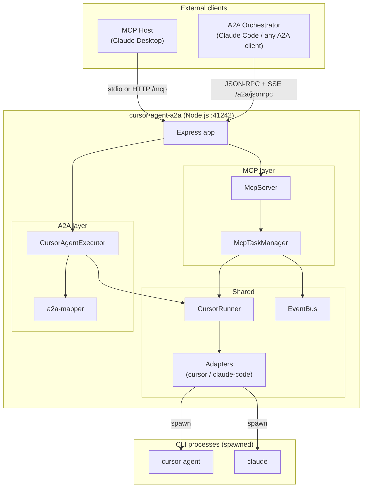
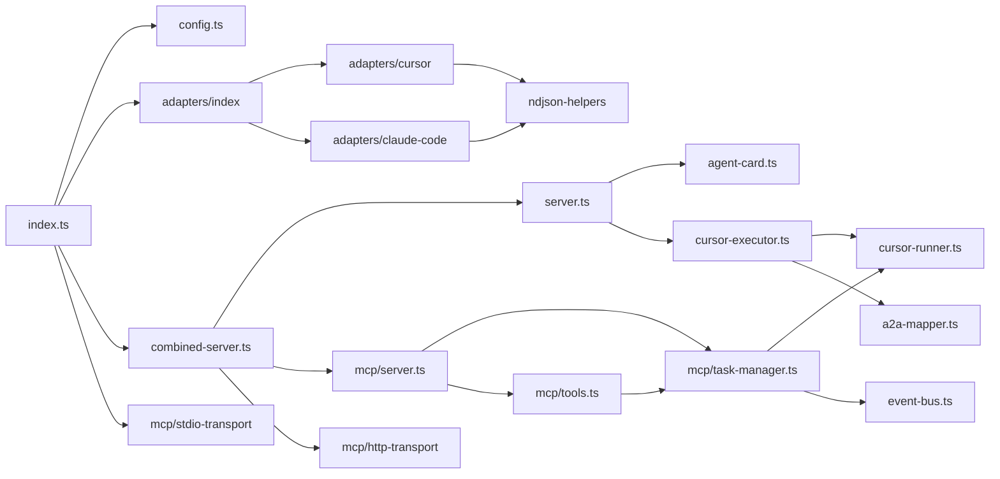
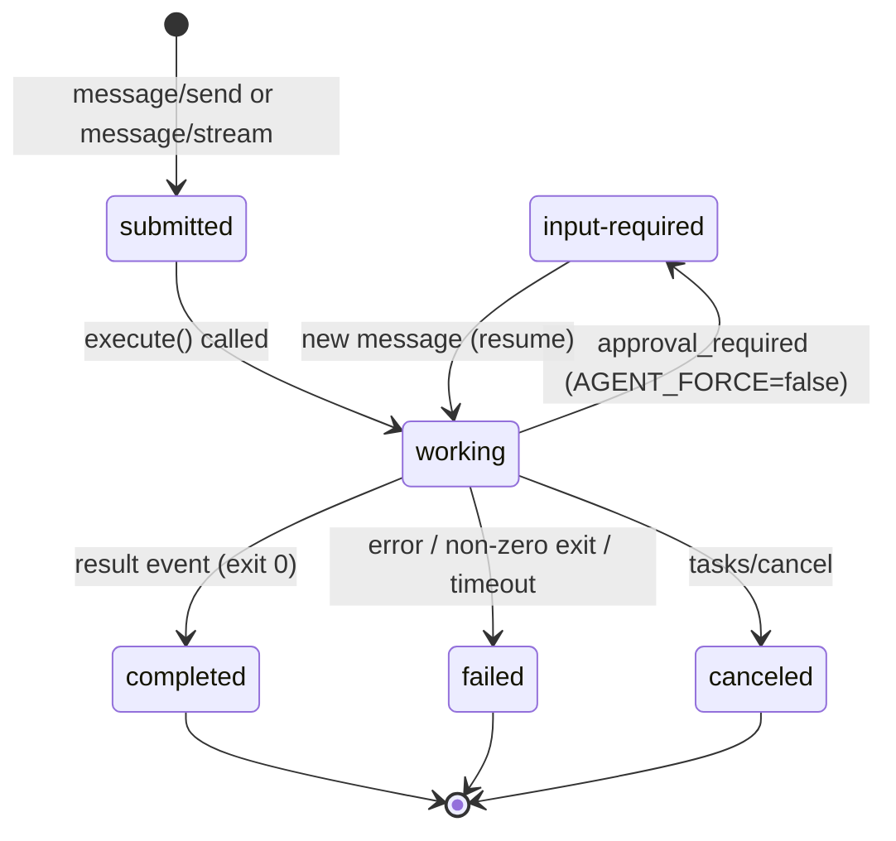
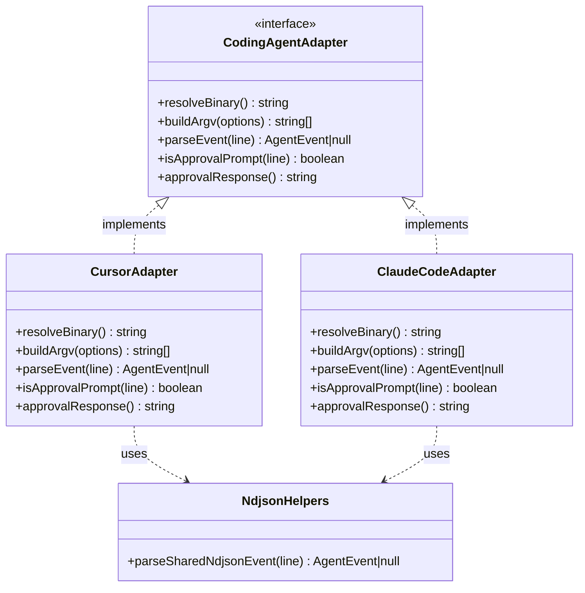
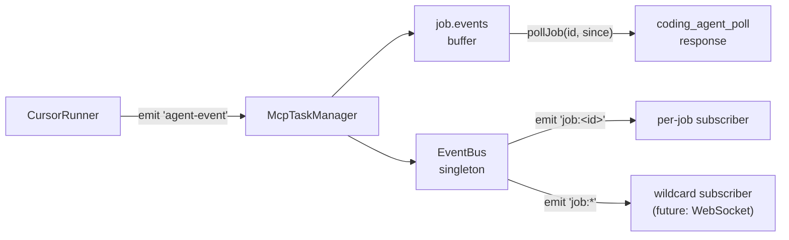
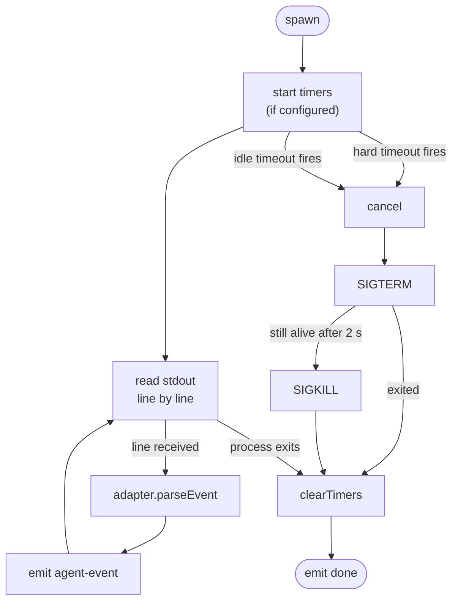

# Architecture

This document describes the internal structure of cursor-agent-a2a: its modules, the data flows for each protocol, and the key design decisions behind the implementation.

---

## Table of contents

1. [System overview](#1-system-overview)
2. [Component map](#2-component-map)
3. [Module responsibilities](#3-module-responsibilities)
4. [A2A data flow](#4-a2a-data-flow)
5. [MCP data flow](#5-mcp-data-flow)
6. [Adapter pattern](#6-adapter-pattern)
7. [Event bus](#7-event-bus)
8. [Process lifecycle](#8-process-lifecycle)
9. [Design decisions](#9-design-decisions)

---

## 1. System overview

cursor-agent-a2a runs as a single Node.js process that bridges two external protocol layers — A2A and MCP — to one or more coding-agent CLIs. Both protocols share the same underlying adapter, runner, and process-lifecycle logic.



---

## 2. Component map

```
src/
├── index.ts                   Entry point: load config, start HTTP server, optionally start stdio MCP
├── config.ts                  Parse env vars → Config
├── types.ts                   Shared TypeScript interfaces (Config)
│
├── combined-server.ts         Express app factory: A2A routes + MCP HTTP routes on one port
├── server.ts                  A2A-only Express app factory (used by combined-server)
├── agent-card.ts              Build the A2A AgentCard object
│
├── cursor-executor.ts         A2A AgentExecutor: spawns CursorRunner per task, publishes A2A events
├── cursor-runner.ts           Spawn CLI → stream NDJSON stdout → emit AgentEvents
├── a2a-mapper.ts              Pure: AgentEvent → A2A SDK event(s)
│
├── event-bus.ts               Process-wide pub/sub for MCP job events
│
├── adapters/
│   ├── base.ts                CodingAgentAdapter interface + AgentEvent union (extension point)
│   ├── cursor.ts              Adapter for cursor-agent CLI
│   ├── claude-code.ts         Adapter for Claude Code CLI
│   ├── index.ts               Registry: resolveAdapter(name)
│   └── ndjson-helpers.ts      Shared NDJSON parser for the common event schema
│
└── mcp/
    ├── server.ts              createMcpServer: create McpServer + register tools
    ├── tools.ts               registerTools: wire 5 MCP tools to McpTaskManager
    ├── task-manager.ts        McpTaskManager: UUID-keyed job store + CursorRunner per job
    ├── stdio-transport.ts     Connect McpServer to StdioServerTransport
    └── http-transport.ts      Create StreamableHTTPServerTransport for /mcp routes
```

### Module dependencies



---

## 3. Module responsibilities

### `config.ts` — configuration boundary

Parses all environment variables once at startup and exposes them as a typed `Config` object. All other modules receive `Config` as a constructor argument — none read `process.env` directly (except `config.ts` and the two adapter `resolveBinary()` methods that honour per-adapter path overrides).

### `adapters/` — extension point

The `CodingAgentAdapter` interface is the only piece a contributor must implement to add a new CLI. It answers four questions:

1. Where is the binary? (`resolveBinary`)
2. What argv does it need? (`buildArgv`)
3. How do I parse one NDJSON line? (`parseEvent`)
4. Is this line an approval prompt? (`isApprovalPrompt` / `approvalResponse`)

Adapters are stateless singletons. All per-run state lives in `CursorRunner`.

### `cursor-runner.ts` — process management

A single `CursorRunner` manages exactly one child process. It:
- Spawns the binary with the adapter-built argv.
- Buffers stdout until newlines arrive and parses each line.
- Enforces hard timeout (`agentTimeoutMs`) and idle-kill timeout (`agentIdleExitMs`).
- Cancels cleanly: SIGTERM → SIGKILL after 2 s.
- Emits typed `AgentEvent`s to its listeners.

Despite the "Cursor" name, `CursorRunner` is adapter-agnostic — it delegates all CLI-specific logic to the adapter.

### `a2a-mapper.ts` — pure translation

A stateless function that converts an `AgentEvent` into zero, one, or two A2A SDK events. It is completely pure (no I/O, no side effects) and is tested exhaustively in isolation. Keeping the mapping separate from the executor makes both easier to test and modify.

### `cursor-executor.ts` — A2A orchestration

Implements `AgentExecutor` from `@a2a-js/sdk`. The SDK calls `execute()` once per incoming message. The executor:
1. Extracts the text prompt from the A2A message parts.
2. Creates a `CursorRunner`, wires event listeners.
3. On each `AgentEvent`, calls `mapAgentEventToA2A` and publishes the result via the SDK's `ExecutionEventBus`.
4. On `done` or `error`, calls `eventBus.finished()` and resolves the promise.

For the `approval_required` / `input-required` flow, the runner stays alive between `execute()` calls. When the SDK calls `execute()` again for the resumed message, the executor finds the existing runner in `_activeRunners` and calls `runner.resume(prompt)`.

### `mcp/task-manager.ts` — MCP job store

Plays the same role as `CursorAgentExecutor` but for MCP: it creates one `CursorRunner` per `startJob()` call, buffers all events in memory, and exposes a polling API. Jobs persist until explicitly cancelled or until `getResult()` reads a completed job.

### `event-bus.ts` — cross-cutting pub/sub

A process-wide `EventEmitter` singleton with two channels per job. Currently used by `McpTaskManager` to broadcast events so external observers (e.g. future WebSocket streams) can subscribe without modifying `McpTaskManager`.

---

## 4. A2A data flow

An A2A client connects over HTTP. `message/stream` is preferred for long tasks — the server pushes progress as Server-Sent Events (SSE). `message/send` blocks until the task completes.

```mermaid
sequenceDiagram
    participant C  as A2A Client
    participant SDK as @a2a-js/sdk
    participant X  as CursorAgentExecutor
    participant R  as CursorRunner
    participant CLI as CLI process

    C->>SDK: POST /a2a/jsonrpc (message/stream)
    SDK->>X: execute(requestContext, eventBus)
    X->>R: new CursorRunner(); start()
    R->>CLI: spawn --print --output-format stream-json

    CLI-->>R: {"type":"system/init","model":"..."}
    R-->>X: emit agent-event: init
    X-->>SDK: status-update {state: working}
    SDK-->>C: SSE: {kind: status-update, state: working}

    CLI-->>R: {"type":"assistant","message":{...}}
    R-->>X: emit agent-event: thinking
    X-->>SDK: artifact-update {append: true}
    SDK-->>C: SSE: {kind: artifact-update}

    CLI-->>R: {"type":"result",...}
    R-->>X: emit agent-event: done
    X-->>SDK: status-update {state: completed, final: true}
    SDK-->>C: SSE: {kind: status-update, final: true}
```

### A2A task state machine



---

## 5. MCP data flow

MCP uses a job-based polling model instead of server-sent events, because MCP tool calls must return synchronously.

```mermaid
sequenceDiagram
    participant M   as MCP Host
    participant TM  as McpTaskManager
    participant R   as CursorRunner
    participant CLI as CLI process

    M->>TM: coding_agent_run {task}
    TM->>R: new CursorRunner(); start()
    R->>CLI: spawn
    TM-->>M: {job_id: "uuid"}

    loop Poll until done
        M->>TM: coding_agent_poll {jobId, sinceLine}
        TM-->>M: {events: [...], done: false}
    end

    CLI-->>R: result event
    R-->>TM: emit agent-event: done

    M->>TM: coding_agent_poll {jobId, sinceLine}
    TM-->>M: {events: [...], done: true}
    M->>TM: coding_agent_result {jobId}
    TM-->>M: {summary, stats, done: true}
    note over TM: job removed from memory
```

---

## 6. Adapter pattern

Both adapters implement `CodingAgentAdapter` and share `parseSharedNdjsonEvent` from `ndjson-helpers.ts` because both CLIs emit the same NDJSON schema. A third adapter only needs to implement `parseEvent` differently if it uses a different schema.



See [CONTRIBUTING.md § Adding a new adapter](../CONTRIBUTING.md#4-adding-a-new-adapter) for the step-by-step guide.

---

## 7. Event bus

The `EventBus` singleton (`src/event-bus.ts`) decouples event producers (`McpTaskManager`) from consumers.



Today only `McpTaskManager` emits on the bus. The wildcard channel is provided for future consumers without requiring changes to the task manager.

The A2A executor does **not** use the event bus — it publishes directly to the SDK's `ExecutionEventBus`.

---

## 8. Process lifecycle

Each `CursorRunner` owns one child process. The `_cancelled` and `_exited` flags prevent duplicate `done` emissions when multiple termination paths race.



---

## 9. Design decisions

### Dual protocol on one port

Both A2A and MCP are served by the same Express app. This simplifies deployment (one process, one port, one systemd unit) and avoids port-allocation conflicts when running locally. The MCP HTTP transport is always mounted at `/mcp`, even when `MCP_TRANSPORT=stdio` — unused routes are harmless.

### Separate McpTaskManager and CursorAgentExecutor

A2A uses the SDK's `InMemoryTaskStore` and `DefaultRequestHandler` for task state. MCP uses its own `McpTaskManager`. Sharing state would create tight coupling between two independent protocol layers and complicate testing. The cost is a small duplication of job-tracking logic.

### Version from git tag

The version is not stored in `package.json` — it is set from the git tag during the publish workflow (`npm version "${TAG#v}" --no-git-tag-version`). This mirrors Python's `setuptools-scm` and ensures the published package version always matches the tag. The `package.json` version (`0.1.0`) is a placeholder.

### No streaming in MCP tools

MCP tool calls are request/response, not streaming. The polling model (`run` → `poll` → `result`) is the standard pattern for long-running MCP tools and is easy to implement in any MCP host including Claude Desktop.

### 100% test coverage

All `src/` modules are covered at 100% line, branch, and function. This is enforced in CI via `@vitest/coverage-v8` thresholds. Type-only files (`types.ts`, `adapters/base.ts`) are excluded from the threshold since they produce no runtime code.
